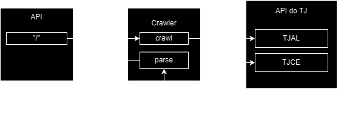

# Juscrawler
Este projeto é uma atividade para seleção da jusbrasil. Nele fiz um pequeno crawler responsável por fazer coleta do TJAL e TJCE.

Segue um vídeo explicativo do projeto:

## Recursos necessários
 + Python
 + pip
 + Flask 			(pip install Flask)
 + beautifulsoup4 	(pip install beautifulsoup4)
 + pytest			(pip install pytest)
 + pytest-regtest	(pip install pytest-regtest)

## Rodando o projeto
Para rodar o projeto navegue até a página do projeto

	py main.py

## Testando a api

O jeito mais fácil de testar a api é importar o postman localizado em ./doc/juscrawler.postman_collection.json. Nele há uma request nomeada de "request da api de processo" já com um processo. O retorno esperado é um array com os dados da primeira instância e segunda instancia. 

	[{1a_instancia},{2a_instancia}]

## Testando o projeto

Como o projeto é bem direto ao ponto, a única oportunidade de teste que faz sentido são testes de regressão. O que significa que o propósito dos testes é garantir que ao fazer alterações no código o comportamento não alterou ou entender que comportamento foi alterado e como ele afeta o código na ponta.

Para rodar os testes execute

	py.test test.py

Caso veja a regressão e queira "aceitá-la", execute

	py.test test.py --regtest-reset

## Sobre a resolução e escolhas

Para resolução desse problema considerei o desenvolvimento apenas do crawler que faria buscas pelas plataformas listadas apenas no momento da pesquisa. Acredito que o ponto principal da atividade não seja guardar os dados em um elasticsearch, mas entender como a coleta deve ser feita e como idealmente seria o mapeamento de retorno. Esta é a razão de não ter workers, indexadores, mappers ou mesmo elasticsearch de maneira mais robusta para fazer a coleta e buscas. Caso tenha entendido de maneira errônea o propósito desta avaliação pode chamar minha atenção que corrigirei o quanto antes.

A stack que estou mais acostumado para crawling é ruby on rails, mas decidi utilizar python tanto para tentar utilizar ferramentas de python que nunca utilizei neste contexto como também para me adequar a stack do time e já ter um pouco de introdução de como fazer uma api, crawler etc em python. 

A razão por trás de Flask é simplesmente por terem sido as primeiras ferramentas que apareceram em uma busca rápida no google. Não tive nenhum rigor nesta escolha e aprendi especificamente para esta tarefa. Comecei utilizando scrapy, mas achei ele meio "crappy". Ele traz uma camada de complexidade para a aplicação que podia muito bem ser feito com requests mais simples utilizando Request + Beautifulsoup. Talvez para algo mais robusto ele seja útil? Pelos meus testes ele facilitou bastante na hora de gerar arquivos. Pelo que li ele já faz um streamline de workers e de sites para crawlear. Acredito que para esses casos são melhores, mas como para mim a aplicação está clara preferi fazer requests diretamente até para entender melhor as libs de requests e de acesso as tags via python (beautifulsoup4).

# O problema
Aqui explicitarei um pouco dos principais problemas encontrados e para onde minha cabeça foi durante a resolução.

### Descobrindo a localização do processo

Como iniciei o desenvolvimento fazendo o a api com flask, o primeiro problema que encontrei foi o resolve de qual URL utilizar para cada caso. 

	NNNNNNN-DD.AAAA.JTR.OOOO

Pesquisando pelas APIS disponibilizadas com o nome dos advogados encontrei o padrão 8.02 para os processos do TJAL e 8.06 para os processos de TJCE onde se encontra o "JTR" no padrão acima.

https://www.trf4.jus.br/trf4/controlador.php?acao=pagina_visualizar&id_pagina=895&idSede=1
https://www.conjur.com.br/dl/resolucao-65-cnj.pdf

Tenho pouca segurança nessa informação então adicionei um parâmetro opcional "localizacao" para a request. Nos exemplos de postman isso ficará mais claro, mas isto implica que se há "localizacao" esta será a info "real" e não tentaria assumir qual a localizacao correta a partir do código.

Possíveis valores ["TJAL","TJCE"]. Qualquer outro valor deve lançar erro.

Decidi colocar isto na camada da api justamente para permitir que esse controle fique lá em cima, mas idealmente isso deveria ser tratado diretamente no crawler.

### Coleta de dados

Incrivelmente aqui foi um pouco trabalhosa principalmente, mas bem simples, dividi a atividade em três etapas:

1. Entender como fazer a request que me leva para aquela página
2. Entender como pegar dados de uma página específica
3. Repetir o passo 1 e 2 para as demais instancias e TJs (comecei com TJAL 1a instancia)

Para um melhor entendimento você pode importar o arquivo ./doc/juscrawler.postman_collection.json no postman. Nele está um exemplo de request a ser feito para a api e as requests que fiz para encontrar a solução do problema.

1. Tanto para o TJCE como para o TJAL na primeira instância:

Fazer uma request para https://www2.tjal.jus.br/cpopg/search.do (ou do ceara) com os params:

	{
	    "cbPesquisa": "NUMPROC",
	    "dadosConsulta.valorConsultaNuUnificado": numero_processo,
	    "dadosConsulta.tipoNuProcesso": "UNIFICADO"
	}

Tenho exemplos dessa request no arquivo do postman com nome: "TJAL1" e "TJCE1"

Essa página já contém as informações do processo, o resto agora é seleção por css + parsing de tabelas, não tem muito mistério.

2. Tanto para o TJCE como para o TJAL na segunda instância:

Já para a segunda instancia, fazendo uma request similar, obtemos uma página intermediária que possui uma seleção de processo. Dessa página eu peguei o código que é utilizado na próxima etapa. Para esta request foi necessário passar os params:

    {
        "cbPesquisa": "NUMPROC",
        "dePesquisaNuUnificado": processo,
        "tipoNuProcesso": "UNIFICADO"
    }

Tenho exemplos dessa request no arquivo do postman com nome: "TJAL2 PEGAR CODIGO" e "TJCE2 PEGAR CODIGO".

Com isto em mãos só precisamos fazer agora a segunda request para https://www2.tjal.jus.br/cposg5/show.do que recebe de parâmetro:

	{
        "processo.codigo": codigo_da_primeira_request,
    }

Tenho exemplos dessa request no arquivo do postman com nome: "TJAL2" e "TJCE2".

O próximo passo é a raspagem de dados que também não tem muito segredo. Acabou que utilizei o mesmo código de parsing, e deu tudo muito certo, precisei apenas de alguns pequenos ajustes quando mudei do TJAL para TJCE.

### O resultado

Para acompanhar o projeto coloquei um pequeno diagrama do projeto e como ele funciona:

### Ameaças a validade

Nesta seção vou pontuar algumas coisas que acredito que poderiam ser melhores e tentar justificar minhas escolhas. De toda forma são pontos de melhoria.

 + O crawler.py está bastante acoplado, em um projeto talvez eu separaria algumas funcionalidades de limpeza, raspagem e busca talvez. Decidi por fazer tudo em um arquivo só justamente para manter a simplicidade do projeto.
 + A localização ser colocada na camada da api é algo que eu acredito que foi uma decisão ruim, eu estou mais seguro que o código 8.02 e 8.06 é o definidor da localização. Acho que em uma atualização eu removeria esse código e colocaria o validador de localização no próprio crawler.
 + O fluxo resultante para crawler.crawl() tem bastante repetição de código. Não acredito que seja um problema esta repetição, uma vez que são repetições com mudanças mínimas, talvez fazer essa chamada em uma função só fosse mais simples, mas comecei pensando que a raspagem de um TJ para outro precisaria de parsers diferentes, então adotei essa medida. Só depois percebi que não. Mas, ainda assim, é necessário passar parâmetros distintos dependendo da instancia e como são sites diferentes, acho que ter essa diferenciação é mais didático.
 + Utilizei exceptions o que pode impactar o desempenho do projeto (Não lembro de cabeça, mas recordo de ler sobre o impacto de exceções em java, acredito que o mesmo impacto ocorra em python), mas utilizar exceptions aumentou a velocidade que codei o projeto, então foi uma decisão pensada.
 + A documentação além de estar fraca está bem mal estruturada e misturada com minhas experiências no desenvolvimento deste projeto. Foi uma decisão pensada também, uma vez que a intenção desse projeto é didático.
 + O parsing das partes é basicamente a parte + os advogados em uma string só separado por vírgula. Idealmente eu separaria autor/reu de advogado de autor/reu.
 + Não sei se essa informação é importante, mas para fazer esse crawler trabalhei no domingo à noite, na segunda à noite e da noite de terça até a madrugada de terça-feira. Ou seja, foram basicamente 3 noites para relembrar python, aprender scrapy, flask e beautifulsoup. Não pude trabalhar neste projeto antes, pois tive de acompanhar o deploy de algo importante no meu emprego atual.

### Agradecimentos
Valeu pela oportunidade, pessoal! Qualquer coisa estou à disposição! =)

---
## O Desafio

O desafio é fazer uma API que busque dados de um processo em todos os graus dos Tribunais de Justiça de Alagoas (TJAL) e do Ceará (TJCE). Geralmente o processo começa no primeiro grau e pode subir para o segundo. Você deve buscar o processo em todos os graus e retornar suas informações.

Será necessário desenvolver crawlers para coletar esses dados no tribunal e uma API para fazer input e buscar o resultado depois.

Input
Você deve criar uma api para receber um json contendo o número do processo. Para descobrir o tribunal você pode pedir no input ou usar o padrão cnj de numeração de processos jurídicos.

Output
O cliente tem que ser capaz de pegar o dado quando o processamento termina, então você deve criar um mecanismo que permita isso, retornando sempre um JSON para os processos encontrados em todas as esferas.

Crawlers / Tribunais onde os dados serão coletados
Tanto o TJAL como o TJCE tem uma interface web para a consulta de processos. O endereço para essas consultas são:

TJAL
1º grau - https://www2.tjal.jus.br/cpopg/open.do
2º grau - https://www2.tjal.jus.br/cposg5/open.do
TJCE
1º grau - https://esaj.tjce.jus.br/cpopg/open.do
2º grau - https://esaj.tjce.jus.br/cposg5/open.do

Dados a serem coletados:
	classe:string
	área
	assunto:string
	data de distribuição:data + tipo
	juiz:string
	valor da ação:double
	partes do processo: {
		autor: [autor + string (advogado do autor)]
		réu:[reu + string (advogado do reu)]
	}
	lista das movimentações (data, movimento, desc)

Exemplos de processos
1º grau - https://www2.tjal.jus.br/cpopg/open.do
2º grau - https://www2.tjal.jus.br/cposg5/open.do

	0710802-55.2018.8.02.0001 - TJAL
	0000269-48.2014.8.02.0024
	0501105-16.2008.8.02.0010
	0500862-24.2007.8.02.0005
	0714787-56.2023.8.02.0001
	NNNNNNN-DD.AAAA.J.TR.OOOO

para mais números de processo, busque no diário oficial de Alagoas: https://www.jusbrasil.com.br/diarios/DJAL/

1º grau - https://esaj.tjce.jus.br/cpopg/open.do
2º grau - https://esaj.tjce.jus.br/cposg5/open.do

	0070337-91.2008.8.06.0001 - TJCE
	0007737-79.2011.8.06.0049
	0125766-96.2015.8.06.0001
	0294190-57.2022.8.06.0001
	NNNNNNN-DD.AAAA.J.TR.OOOO

para mais números de processo, busque no diário de justiça do estado do Ceará: https://www.jusbrasil.com.br/diarios/DJCE/

Alguns pontos que serão analisados:
	+ Organização do código: se o código está limpo e organizado, de acordo com a formatação adequada;
	+ Testes;
	+ Tratamento de erros;
	+ Facilidade ao rodar o projeto;
	+ Escalabilidade: o quão fácil é escalar os crawlers;
	+ Performance: aqui avaliamos o tempo para coletar todo o processo jurídico.
